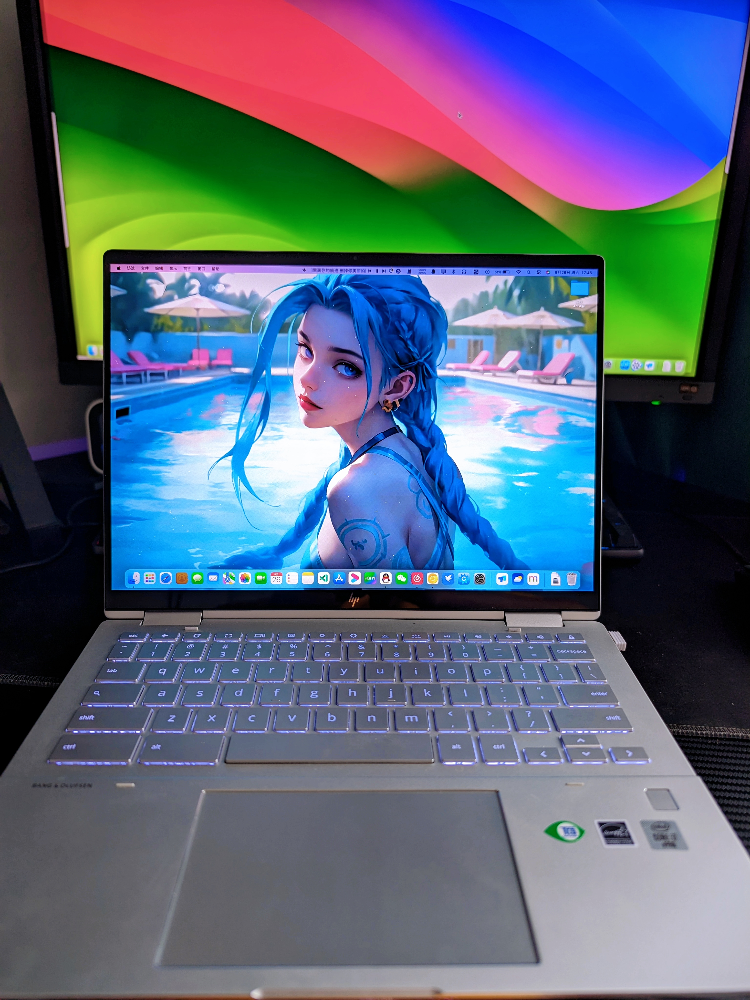

# HP Elite C1030 / x360 13c Chromebook Hackintosh
 <!-- About achieving the perfect hackintosh on the HP Elite C1030/x360 13c Chromebook models. -->
 在HP Elite C1030/x360 13c Chromebook机型上实现黑苹果。没时间写详细安装教程，简单说下思路，首先解锁刷bios（这个自行参考[Chromebook研究院](http://120.79.199.53?_blank)相关教程），
 然后U盘用工具Etcher写入MacOS镜像安装包,[点击此处下载](https://pan.starsnwind.com/t/u1eLSO)。最后把EFI放入硬盘ESP分区，进行安装完成。
 MacOS安装的具体操作可参照[黑果小兵](https://blog.daliansky.net/Intel-NUC9-Hackintosh-and-macOS-Sonoma-Installation-Tutorial.html?_blank)。

---------------------------------------------------------------------------------------------------------------------------------------------------
 ### 加入交流群：112526282 
---------------------------------------------------------------------------------------------------------------------------------------------------

##  概况
#### 最佳仿制机型：MacBook Air（视网膜显示屏，13 英寸，2020 年）
<!-- ## ||| -->
---------------------------------------------------------------------------------------------------------------------------------------------------
| 关于本机 | 实拍图 |
|------------|-------------|
|||

### MacOS版本(最新支持)：MacOS Sonoma (14) Beta7 （推荐14，低版本自行更换wifi驱动）
### OpenCore版本(最新支持)：OpenCore 0.9.5
### CoreBoot版本(最新支持)：BIOS 4.21

### 基本硬件信息：
#### 惠普 Elite C1030/x360 13c Chromebook （JinLon）       
|            硬件 | 型号                                                                 | 
|---------------:|:---------------------------------------------------------------------|
|          处理器 | 英特尔 酷睿 i3-10110U / i5-10310U / i7-10610U                         |
|            内存 | 16GB（8GB x2）DDR4 2666MHz（板载）                                    |
|            硬盘 | 固态硬盘 128GB /256GB（可自行更换 NVMe 2230 2240，推荐西数SN740）        |
|            显卡 | 英特尔核芯显卡 UHD 620 / 630 / 655                                    |
|      无线 + 蓝牙 | 英特尔 AX201 无线网卡 (Wi-Fi 6 + 蓝牙 5.2)                            |
|            声卡 | 英特尔 SOF 音频                                                            |
|          显示器 | 惠普 (13.5 英寸 1920*1280 分辨率)                                    |
---------------------------------------------------------------------------------------------------------------------------------------------------

### 完美计划进度->98%

| **功能**            | **状况**             | **说明**                                                                                             |
|--------------------|----------------------|-----------------------------------------------------------------------------------------------------|
| CPU睿频             | 正常                 | 已对CPU进行定制驱动，变频正常，性能最大化                                                                  |
| 电池/供电            | 正常                 | 支持65W快充，电池数据及相关传感器信息准确显示                                                              |
| 无线网络             | 正常                 | 连接稳定，连接wifi6速度正常，旧版自行更换旧版的无线网卡驱动[AirportItlwm.kext](https://github.com/OpenIntelWireless/itlwm/releases)                                                                            |
| 蓝牙                | 正常                 | 蓝牙5.2设备连接正常、稳定，AirPods系列耳机自带功能正常                                                      |
| 睡眠                | 正常                 | 睡眠质量不错，正常唤醒，可自行定义hibernatemode，推荐0或3                                                   |
| 键盘                | 正常                 | 美式标准按键，除Command位置不同和部分功能快捷键其他按键正常，可自行改键                                         | 
| 键盘背光             | 正常                 | 已经完美驱动，可6级调节，快捷键：`Ctrl + Alt + < 或 >`                                                                    |           
| 功能快捷键           | 部分正常              | 亮度调节和声音调节正常使用，完整功能需要尝试重新映射（正在修复）                                                        |
| 触控板              | 正常                  | 点按、手势相关功能都正常使用，可在设置触控屏进行偏好设置                                                      | 
| 触摸屏              | 正常                  | 已正常驱动，使用体验还是挺不错的                                                         | 
| 核显                | 正常                 | 已定制最佳缓冲帧和显卡4G显存，激活H264和HEVC硬件加速，4K、HDR真彩流畅播放                                      |
| NVME固态硬盘         | 正常                 | 实测更换西数SN740固态后可直接免驱使用，可去掉`NVMeFix.kext`驱动，保证供电建议保留                                  |    
| HDMI/DP显示器       | 正常                  | 使用TypeC转DP或HDMI可正常连接4k显示器                                                                   |
| HDMI音频            | 正常                 | 正常使用，配合使用TypeC转DP或HDMI连接显示器， 显示器无外放可连音响                                            |                                      
| USB端口             | 正常                 | 已完美定制USB驱动和内建控制器，端口、蓝牙正常使用                                                            |
| 摄像头              | 正常                  | 正常免驱，同时快捷开关键正常使用，一键开关                                                                  |
| 注销/锁屏           | 正常                  | 正常，和原生MacOS无差别                                                                                 |
| 关机/重启           | 正常                  | 正常开关机和重启，同时注入不影响                                                                          |    
| HDPI                | 正常                | 因为1080p原生不支持，可以用`BetterDisplay`等HDPI软件来强开，并且会修复logo不一致问题，推荐1920x1280分辨率或者1600x1066                                                                      |
| 内置外放             | 已禁用               | 暂时无驱动，`Sof.kext`在路上了，可使用蓝牙音响或耳机平替                                                               |
| 3.5mm耳机接口        | 已禁用               | 受声卡无法驱动影响，无法使用                                                                              |
| 内置麦克风           | 已禁用               | 受声卡无法驱动影响，无法使用                                                                              |
| SD卡                | 已禁用               | 目前暂时无法驱动，已在SSDT禁用以省电                                                                      |
| 指纹                | 已禁用               | 目前暂时无法驱动，已在SSDT禁用以省电                                                                      |
---------------------------------------------------------------------------------------------------------------------------------------------------

### 注意事项：
1.安装完成后请自行使用OC工具进行更新三码，以保证后续正常食用

2.不要随意改动EFI，关键补丁和驱动缺失，容易导致黑屏或加载不进系统

3.类似模具也可以使用，比如Acer 713等CB本

4.macOS13及之前版本自行更换无线网卡驱动

5.未经允许禁止转载使用商业化，免费开源，需要注明出处！